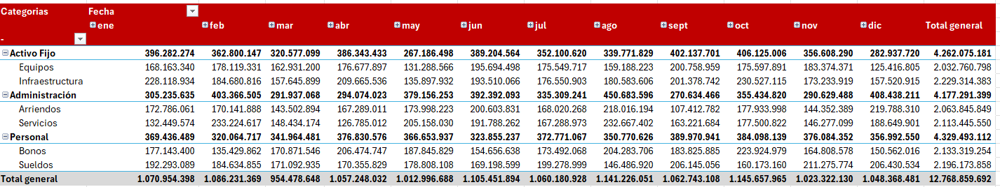
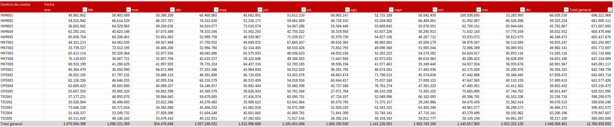

# Análisis de Gastos y Control Presupuestario

## Contexto

Este proyecto está inspirado en procesos reales de control de gestión en banca, donde se analizan gastos operacionales, desviaciones presupuestarias y comportamiento por centros de costo.

---

## Descripción

Este proyecto simula un análisis de control de gestión sobre gastos operacionales, similar a los procesos realizados en banca.

Se utilizan consultas SQL para analizar el comportamiento del gasto, identificar desviaciones presupuestarias y evaluar variaciones mensuales.

---

## Objetivo

El objetivo es replicar un flujo básico de análisis financiero:

- Entender en qué se está gastando
- Comparar gasto real vs presupuesto
- Identificar desviaciones
- Analizar tendencias en el tiempo

---

## Dataset

El dataset fue generado en Excel simulando información de gastos, incluyendo:

- Categorías (Personal, Administración, Activo fijo)
- Centros de costo
- Fechas
- Montos

---

## Análisis realizados

Las consultas SQL incluyen:

- Gasto total por categoría
- Comparación contra presupuesto
- Variaciones mes a mes usando funciones como LAG()
- Ranking de centros de costo con mayor gasto

---

## Insights

- La categoría Personal concentra el mayor gasto total, lo que refleja una estructura de costos intensiva en capital humano. Este tipo de comportamiento es típico en organizaciones donde los costos fijos tienen un peso relevante en la operación.

- A nivel de centros de costo, Inmuebles presenta el mayor gasto acumulado, lo que sugiere una alta carga de costos asociados a infraestructura, como arriendos y mantenimiento.

- Se observa una concentración del gasto en pocos centros de costo, lo que indica una distribución no homogénea y posibles focos críticos de control financiero.

- El mes de octubre presenta un aumento significativo en el gasto en los principales centros de costo, lo que podría estar relacionado con ajustes contables, cierre de presupuesto o eventos operacionales específicos.

- La combinación de alta concentración de gasto y variaciones mensuales sugiere oportunidades para mejorar el control presupuestario y anticipación de desviaciones.

---

### Visualizaciones

Categorias

---

Centros de costos

