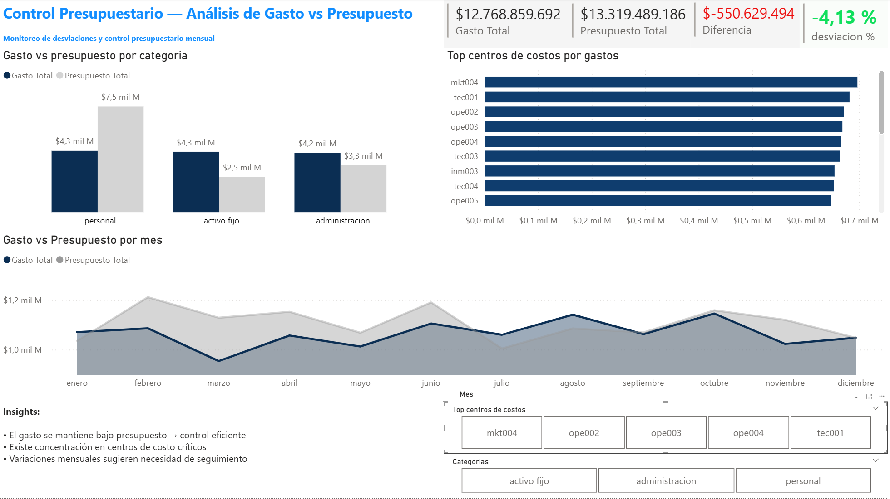

# Análisis de Gastos y Control Presupuestario

Este proyecto simula un análisis típico de control de gestión financiero, enfocado en el comportamiento del gasto y su comparación contra presupuesto.

Está inspirado en procesos reales de banca, donde este tipo de análisis es clave para la toma de decisiones.

---

## Datos

Se utilizaron dos datasets:

- `Gastos.csv`: contiene el gasto real por categoría, centro de costo y fecha  
- `Presupuesto.csv`: contiene el presupuesto asociado  

---

## Proceso

Se trabajó principalmente en SQL, considerando:

### Limpieza de datos
- TRIM → eliminación de espacios  
- LOWER → estandarización de texto  
- REPLACE → corrección de formatos  
- CAST → normalización de tipos numéricos  

---

## Análisis realizados

- Gasto total por categoría  
- Comparación gasto real vs presupuesto  
- Variaciones mes a mes utilizando LAG  
- Ranking de centros de costo por gasto  

---

## Visualización

Se desarrolló un dashboard en Power BI con:

- KPIs de gasto y presupuesto  
- Evolución mensual  
- Comparación por categoría  
- Ranking de centros de costo  

---

## Archivos

- `data/` → datasets  
- `sql/` → queries  
- `visuals/` → imágenes y gif del dashboard  
- `dashboard.pbix` → archivo Power BI  

---

## Dashboard

Imagen general:

---

## Interacción

Ejemplo de uso del dashboard:

---

## Conclusiones

- El gasto se concentra en pocas categorías relevantes  
- Existen variaciones mensuales que requieren seguimiento  
- El análisis permite identificar focos de control financiero  

---

## Contexto

Este proyecto refleja tareas comunes en control de gestión en banca, donde el análisis de gastos y desviaciones presupuestarias es parte del trabajo diario.
