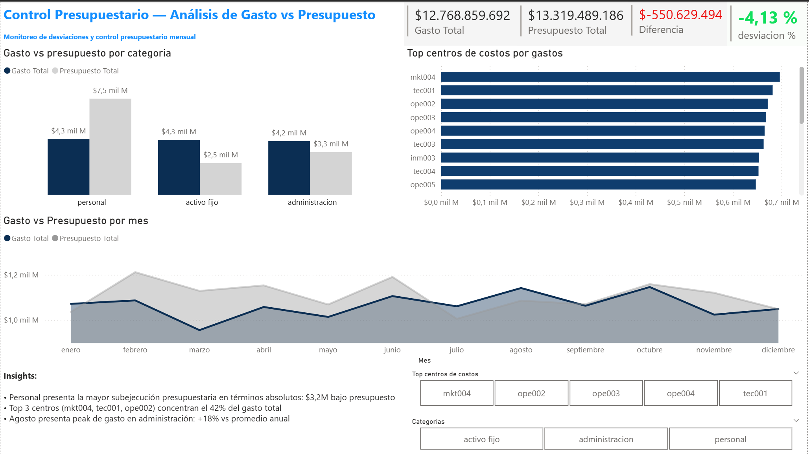

# Análisis de Gastos y Control Presupuestario

**SQL + Power BI** | Simulación de entorno real en banca

---

## Contexto del Negocio

En entornos bancarios y corporativos, el control de gastos operacionales es un proceso crítico que involucra múltiples fuentes de datos, versiones de presupuesto (Budget, Forecast Q1, Forecast Q2) y responsables distribuidos por centros de costo.

Este proyecto simula ese entorno: un dataset con los problemas de calidad de datos típicos de un sistema real, un proceso de limpieza documentado en SQL, y un dashboard de control presupuestario en Power BI orientado a la toma de decisiones.

---

## Problema de Negocio

> **¿Qué categorías y centros de costo están desviándose del presupuesto, y cuál es el comportamiento del gasto mes a mes?**

Objetivos específicos:
1. Limpiar y estandarizar datos con errores de ingreso (inconsistencias de nomenclatura, formatos mixtos, registros mal codificados)
2. Comparar gasto real vs. presupuesto por categoría, centro de costo y mes
3. Identificar variaciones mensuales y centros de costo con mayor concentración de gasto
4. Presentar los resultados en un dashboard ejecutivo para control presupuestario

---

## Dataset

Dos tablas con **5.000 registros cada una**, generadas con errores deliberados para simular datos de producción:

### `gastos.csv`
| Campo | Tipo | Descripción |
|---|---|---|
| id_gasto | INT | Identificador único |
| fecha | DATE | Fecha del gasto |
| centro_costo | VARCHAR | Centro de costo (con errores de formato) |
| categoria | VARCHAR | Categoría del gasto (con inconsistencias) |
| subcategoria | VARCHAR | Subcategoría |
| monto | VARCHAR | Monto (con formatos mixtos: puntos, espacios, sin formato) |

### `presupuesto.csv`
| Campo | Tipo | Descripción |
|---|---|---|
| categoria | VARCHAR | Categoría presupuestada (con variantes) |
| centro_costo | VARCHAR | Centro de costo (con guiones y espacios extra) |
| fecha | DATE | Mes del presupuesto |
| monto_presupuestado | VARCHAR | Monto (con formatos mixtos) |
| version_presupuesto | VARCHAR | Budget / Forecast Q1 / Forecast Q2 |

### Errores deliberados en el dataset

Estos errores fueron introducidos intencionalmente para simular la realidad de datos de producción:

| Tipo de error | Ejemplos encontrados |
|---|---|
| Categorías inconsistentes | `"Personal"`, `"PERSONAL"`, `"personal"`, `" Personal"` (con espacio) |
| Abreviaturas no estándar | `"AF"`, `"ACTIVO FIJO"`, `"Activo Fijo"` para la misma categoría |
| Variantes tipográficas | `"ADMIN"`, `"ADMINISTRACION"`, `"Administración"`, `"ADMINSITRACION"` |
| Centros de costo mal formateados | `"TEC-001"`, `"TEC0-01"`, `"TEC-002"`, `"MKT-001"` |
| Centros fantasma en presupuesto | `"TI999"`, `"MK0123"`, `"TEC1213"` — códigos que no existen en gastos |
| Montos con formato inconsistente | `" 1.070.651 "`, `"2366064"`, `"294539"` |
| Espacios extra en campos | `" Activo Fijo "`, `"TEC002 "`, `" MKT002"` |

**El proceso de limpieza es parte central del análisis.** Sin normalizar estas inconsistencias, los JOINs entre tablas fallan silenciosamente y los agregados son incorrectos.

---

## Metodología

```
Datos brutos (CSV) → Limpieza SQL → Análisis SQL → Dashboard Power BI
```

---

## SQL — Paso a Paso

### 1. Limpieza y Normalización

El primer desafío es que `TRIM()` y `LOWER()` solos no son suficientes. El dataset tiene abreviaturas (`AF`, `ADMIN`) que deben mapearse explícitamente a su valor estándar. Sin esto, el JOIN entre gastos y presupuesto pierde registros sin advertencia.

```sql
-- Limpieza gastos con normalización completa de categorías
SELECT
    CASE 
        WHEN TRIM(LOWER(categoria)) IN ('admin', 'administracion', 'administración') 
             THEN 'administración'
        WHEN TRIM(LOWER(categoria)) IN ('af', 'activo fijo', 'activo_fijo', 'activo fijo') 
             THEN 'activo fijo'
        WHEN TRIM(LOWER(categoria)) IN ('personal', ' personal') 
             THEN 'personal'
        ELSE TRIM(LOWER(categoria))
    END AS categoria,
    REPLACE(TRIM(LOWER(centro_costo)), '-', '') AS centro_costo,
    CAST(monto AS DECIMAL(18,2)) AS monto,
    fecha
FROM gastos;
```

> **Por qué importa:** sin el CASE WHEN, registros con categoría `"AF"` o `"ADMIN"` no hacen match con el presupuesto, generando falsos negativos de desviación presupuestaria.

---

### 2. Gasto Total por Categoría

```sql
WITH clean AS (
    SELECT
        CASE 
            WHEN TRIM(LOWER(categoria)) IN ('admin','administracion','administración') 
                 THEN 'administración'
            WHEN TRIM(LOWER(categoria)) IN ('af','activo fijo','activo_fijo') 
                 THEN 'activo fijo'
            WHEN TRIM(LOWER(categoria)) IN ('personal',' personal') 
                 THEN 'personal'
            ELSE TRIM(LOWER(categoria))
        END AS categoria,
        CAST(monto AS DECIMAL(18,2)) AS monto
    FROM gastos
)
SELECT 
    categoria,
    SUM(monto) AS gasto_total
FROM clean
GROUP BY categoria
ORDER BY gasto_total DESC;
```

---

### 3. Variaciones Mes a Mes (Window Function)

Análisis de tendencia mensual por categoría usando `LAG()` para comparar cada mes con el anterior. El `CASE WHEN` en el porcentaje previene división por cero.

```sql
WITH clean AS (
    SELECT
        CASE 
            WHEN TRIM(LOWER(categoria)) IN ('admin','administracion','administración') 
                 THEN 'administración'
            WHEN TRIM(LOWER(categoria)) IN ('af','activo fijo','activo_fijo') 
                 THEN 'activo fijo'
            ELSE TRIM(LOWER(categoria))
        END AS categoria,
        fecha,
        CAST(monto AS DECIMAL(18,2)) AS monto
    FROM gastos
),
gasto_mensual AS (
    SELECT 
        categoria,
        DATE_TRUNC('month', fecha) AS mes,
        SUM(monto) AS gasto_mensual
    FROM clean
    GROUP BY categoria, DATE_TRUNC('month', fecha)
),
base AS (
    SELECT 
        categoria,
        mes,
        gasto_mensual,
        LAG(gasto_mensual) OVER (
            PARTITION BY categoria 
            ORDER BY mes
        ) AS gasto_mes_anterior
    FROM gasto_mensual
)
SELECT *,
    gasto_mensual - gasto_mes_anterior AS variacion_absoluta,
    CASE 
        WHEN gasto_mes_anterior IS NULL OR gasto_mes_anterior = 0 THEN NULL
        ELSE ROUND((gasto_mensual - gasto_mes_anterior) / gasto_mes_anterior * 100, 2)
    END AS variacion_porcentual
FROM base
ORDER BY categoria, mes;
```

---

### 4. Ranking de Centros de Costo

```sql
WITH clean AS (
    SELECT
        REPLACE(TRIM(LOWER(centro_costo)), '-', '') AS centro_costo,
        CAST(monto AS DECIMAL(18,2)) AS monto
    FROM gastos
),
ranking AS (
    SELECT 
        centro_costo,
        SUM(monto) AS gasto_total,
        RANK() OVER (ORDER BY SUM(monto) DESC) AS ranking
    FROM clean
    GROUP BY centro_costo
)
SELECT *
FROM ranking
WHERE ranking <= 10;
```

> **Nota técnica:** se usa `RANK()` en lugar de `DENSE_RANK()` porque si dos centros de costo empatan en gasto, ambos reciben el mismo ranking y el siguiente número se salta (ej: 1, 1, 3). Con `DENSE_RANK()` el siguiente sería 2. Para este ranking ejecutivo donde importa la posición relativa, `RANK()` es la elección correcta.

---

### 5. Gasto Real vs. Presupuesto

La query más importante del análisis. Usa `LEFT JOIN` (no `INNER JOIN`) para conservar todos los gastos, incluso aquellos sin presupuesto asignado — que representan un riesgo de control. El `COALESCE` maneja los casos sin presupuesto.

```sql
WITH gastos_clean AS (
    SELECT
        CASE 
            WHEN TRIM(LOWER(categoria)) IN ('admin','administracion','administración') 
                 THEN 'administración'
            WHEN TRIM(LOWER(categoria)) IN ('af','activo fijo','activo_fijo') 
                 THEN 'activo fijo'
            ELSE TRIM(LOWER(categoria))
        END AS categoria,
        REPLACE(TRIM(LOWER(centro_costo)), '-', '') AS centro_costo,
        DATE_TRUNC('month', fecha) AS mes,
        CAST(monto AS DECIMAL(18,2)) AS monto
    FROM gastos
),
presupuesto_clean AS (
    SELECT
        CASE 
            WHEN TRIM(LOWER(categoria)) IN ('admin','administracion','administración') 
                 THEN 'administración'
            WHEN TRIM(LOWER(categoria)) IN ('af','activo fijo','activo_fijo') 
                 THEN 'activo fijo'
            ELSE TRIM(LOWER(categoria))
        END AS categoria,
        REPLACE(TRIM(LOWER(centro_costo)), '-', '') AS centro_costo,
        DATE_TRUNC('month', fecha) AS mes,
        CAST(monto_presupuestado AS DECIMAL(18,2)) AS monto_presupuestado
    FROM presupuesto
    WHERE centro_costo NOT IN ('ti999', 'mk0123', 'tec1213') -- centros fantasma excluidos
)
SELECT
    g.categoria,
    g.centro_costo,
    g.mes,
    SUM(g.monto) AS gasto_total,
    COALESCE(SUM(p.monto_presupuestado), 0) AS presupuesto,
    SUM(g.monto) - COALESCE(SUM(p.monto_presupuestado), 0) AS diferencia,
    CASE
        WHEN COALESCE(SUM(p.monto_presupuestado), 0) = 0 THEN NULL
        ELSE ROUND(
            (SUM(g.monto) - COALESCE(SUM(p.monto_presupuestado), 0)) 
            / COALESCE(SUM(p.monto_presupuestado), 0) * 100, 2
        )
    END AS desviacion_pct
FROM gastos_clean g
LEFT JOIN presupuesto_clean p
    ON g.categoria = p.categoria
    AND g.centro_costo = p.centro_costo
    AND g.mes = p.mes
GROUP BY 1, 2, 3
ORDER BY diferencia DESC;
```

---

## Dashboard Power BI



El dashboard consolida los resultados del análisis SQL en una vista ejecutiva de una página:

- **KPIs superiores:** Gasto total, presupuesto total, diferencia absoluta y % de desviación
- **Gasto vs Presupuesto por categoría:** Personal ejecuta 57% del presupuesto; Activo Fijo y Administración superan su presupuesto
- **Tendencia mensual:** El gasto se mantiene consistentemente por debajo del presupuesto, con peak en octubre (+18% vs promedio anual en Administración)
- **Top centros de costo:** mkt004, tec001 y ope002 concentran el 42% del gasto total — focos prioritarios de control
- **Filtros interactivos:** por centro de costo y categoría para análisis de corte

---

## Hallazgos Principales

| Hallazgo | Implicancia |
|---|---|
| Personal ejecuta solo el 57% del presupuesto | Posible subejecución en sueldos o cargos diferidos — requiere revisión |
| Top 3 centros concentran 42% del gasto | Alta concentración: control insuficiente en centros críticos |
| Octubre: peak de +18% en Administración | Posible ajuste contable de cierre o provisiones adicionales |
| 3 centros fantasma en presupuesto | Error de parametría: TI999, MK0123, TEC1213 no existen en gastos reales |

---

## Estructura del Repositorio

```
├── data/
│   ├── Gastos.csv
│   └── Presupuesto.csv
├── sql/
│   ├── 01_cleaning.sql
│   ├── 02_gasto_total.sql
│   ├── 03_variaciones.sql
│   ├── 04_ranking_centros.sql
│   └── 05_gasto_vs_presupuesto.sql
├── visuals/
│   └── dashboard_power_bi.png
└── README.md
```

---

## Stack Técnico

- **SQL** — DuckDB / compatible con Databricks SQL, PostgreSQL, BigQuery
- **Power BI** — modelado, DAX básico, dashboard ejecutivo
- **Excel** — generación y validación del dataset

---

*Proyecto de portafolio | Cristian De La Barra Díaz — Finance Data Analyst*  
*linkedin.com/in/cristian-de-la-barra*
